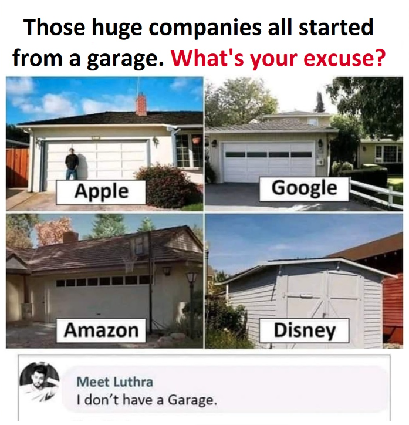

# How Alim Started 

### [← Back](alim-ul-karim-profile.md)

[Md. Alim Ul Karim](https://github.com/aukgit) started when there was no [stack overflow](https://stackoverflow.com/). 

 

**Alim** got fascinated with gaming in 1994, in DOS games. In 1996 he got hooked on DOOM, a first person shooter game at the time (still plays [Doom Eternal](https://bethesda.net/en/game/doom)). **Alim**’s interest in gaming went too far. So he wanted to play very good games. But there's always a crisis in the story, which was the financial crisis. And it was very difficult because he was not from a rich family. 
**Alim** began with **HTML** (which is not considered as a programming language) around the year **2000** that did not lead to any money which he was striving for. In **2001**, he actually started writing **digital** content, he was making **cheat-book** guides and sold to his closest friends around 35 Taka per book. The book was compiled by **collecting** stuff from different sites, books and magazines which actually included the cheat codes for the **interesting** games. But too bad he didn’t earn **enough** from the nearly **15** copies sold! This was the first time **Alim** started his own business and it failed. 
Md. **Alim** Ul Karim went to Dhaka Residential Model College and had a good reputation throughout. Around that time a few seniors from **Alim**’s college participated in a science fair. At that time, they have created **2/3** nice softwares. 
In **2001**, **Alim** first saw a few school seniors in 12th grade create some amazing softwares, and the most **fascinating** thing was an .exe application; **Alim** could double click and open it, and it could do something. This event inspired **Alim** to start making applications for the **first** time. He chose Flash because it seems very easy, **Alim** could do some interaction with the .exe, and the .exe could show a button. So, Flash was a crazy journey because this was the first time he was able to make an .exe application in **Windows**, that you can click and do some stuff that was pretty fun. Flash actually inclined the pathway to the world of programming for **Alim**. Soon installed **VB6** but he didn't know any programming. 
In **2004** he got some books and materials and started **programming**. The crazy journey was fueled for earning the money, the hunger was there to get some money. There were not many **good materials** at the time of **2004**. The Internet was pretty expensive and used to cost roughly **8k** to **10k** BDT **(140$-170$)** being out of the reach at the time for **Alim**. 
The only way to learn was to read the magazine or go to a cyber cafe to download some things and proceed with that. So in **2004**, **Alim** started his first programming language, the first one with **VB6**, it was the hot piece of cake at the time. **ADO** by **Microsoft** helped him understand how to design databases and is still in use to this date which is called **ADO.NET**. **Alim** soon started to wonder why he should use other softwares as it will limit his potential and started to do more research to learn more. Soon **Alim** realized, if he relied only on tools he wouldn't be able to go far. That's when **Alim** started learning more about **database** systems and **programming**. In the beginning due to very limited access to resources he had to learn a lot himself and made a lot of mistakes. 
Everyone begins with **"Hello, world."** However, **Alim** began by developing his own database system. Isn't that crazy? He failed soon after. **5-6** months later, **Alim** presented his work to his college professor. He also made a few suggestions. He inquired as to what would happen if we had **100** users. **Alim** stated that getting the data would take **5** minutes. And he chuckled, saying it wouldn't work since it's too slow. 
**Alim** soon started creating his own softwares. Back in **2004** there was a big boom in the **CD** and **DVD** market and he built a system that could autorun any **CD** or **DVD**. He soon approached the market to sell the software but it was not a successful venture as there were a lot of piracy concerts at the time. 
After that, **Alim** became obsessed with databases. Soon after, **Alim** began developing a system to obtain SQL boilerplate. A screen was created using that framework. In **2005**, we could query any type of database in any way possible using this screen. This was **Alim**’s first encounter. It was a difficult journey where **Alim** failed multiple times but never gave up! 
 
 
 
**Developer's Organism** was also constructed in a **garage**. In spite of being registered in **2008** and conducting some operations, it choose not to **re-register**.

### [← Back](alim-ul-karim-profile.md)
