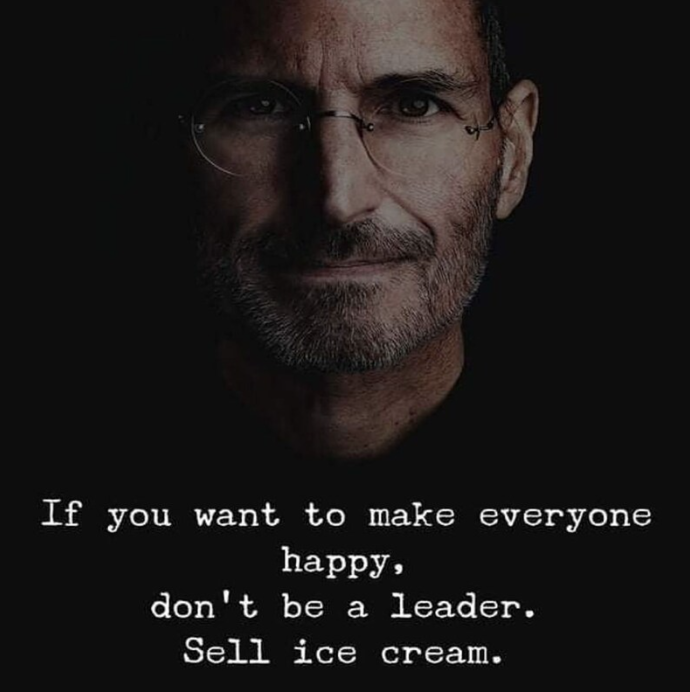

# Why Hiring Alim Is A Smart Investment For Your Company

### [← Back](alim-ul-karim-profile.md)

[Md. Alim Ul Karim](https://www.linkedin.com/in/alimkarim/) is not an out-of-the-world developer even though a [senior software architect and a leader](https://www.linkedin.com/in/istiaq-ahmed-b6906416?lipi=urn%3Ali%3Apage%3Ad_flagship3_profile_view_base_recommendations_details%3BR6T6PNxXTsaVvOuiZe2vYg%3D%3D) recommend him like  “ Alim is one of those out of this world developers that keep impressing you everyday. He is truly gifted”

## What Alim Brings to the table

### Experience

[Md. Alim Ul Karim](https://www.linkedin.com/in/alimkarim/) was always hired for his expertise and experience rather than his credentials. He is not a contest winner, however, he is adept at dealing with **real-world problems**. He prefers real-life problems more than programming contests. 
The Daily Star and the website of the ECE department at NSU all published Alim's research thesis. 

### Performance

[Md. Alim Ul Karim](https://www.linkedin.com/in/alimkarim/) can perform at most **1.2x** to **1.5x** but forecasts what is wrong and right as a result (it also compiles out-of-the-box thinking) and outperforms this amount by **3x** to **4x**. (The limiting factor is the company's constraints - if they are bounded) and in reality, it takes time for everyone to learn in a new setting, but once **Alim** learns, he can onboard people at least 1.5 times faster than others. **Alim** cannot do two clicks at the same time, but he can clone the junior developer to work like him. 
Skill **replication** is crucial. Computers lack intelligence or competence, but we can teach it specific duties and train it so that it can be automated. **Alim** can **teach** new developers how to perform similarly to him by using the same techniques. A format is a very simple and efficient thing **Alim** introduces to new recruits. May it be code or document, **Alim** introduces a format that the recruits can follow to improve **efficiency** and get an output result similar to **Alim** himself. 

### Training

[Md. Alim Ul Karim](https://www.linkedin.com/in/alimkarim/) cannot do magic, however, what he excels at is **skill** **replication**. With all the talent in the world, if you can't duplicate yourself, you can't perform at your best because one person makes two clicks at once. For example, a junior developer can perform with 60%-80% efficiency, complementary if **Alim** knows the system and trains them they can persform as as **Alim** by his training and mentoring. 

### Expertise

Regular developer **mutates** code whereas **Alim** functional approach. He has a great **IDE coloring setup** to highlight any **mutating variable** and **reduce** the mutation. Mutation, in general, should be avoided unless you have a very good reason for it, mutation is bad. 
[Md. Alim Ul Karim](https://www.linkedin.com/in/alimkarim/) prefers **functional programming** to code mutation. It has benefits over its tradeoffs. There are a few trade-offs with functional programming (a bit memory hungry). **However**, it has the added benefit of preventing coding errors, which saves many hours of **programming** time and **money** in the long run. It offers a greater **long-term** benefit. You do not need to consider the mutation and rely on the present value. **Alim** used functional programming to redesign the PersonalVPN (windows) to produce stable releases in the Windows version. (link)

### Review guides ( C#, Golang, Front-End )

- [Code Review Documents](https://github.com/aukgit/CodeReview.Documents/blob/master/README.md)
- [C# code review guide (not complete)](https://docs.google.com/document/d/1nTCocaJf3IeD3YgfJFuK9u7C-4mdIsyTzgyEiaoFC4M/edit?usp=sharing)
- Golang
  - [Golang Code : Review Guides](https://hackmd.io/t6T_Wyv9TimWR1HzvrUQDg)
  - [Golang Method Document](https://hackmd.io/HH-L0_SzSeyC2CEacjzwjQ)
- [Front-end code Review notes](https://hackmd.io/X-Ld5KrVRJmffo8xsikAXQ)

### Soft skills (it should be mutual)

Soft skills are an essential part of improving one’s ability to work with others. Soft skills can be invaluable to business success and **Alim** has all the right skills to help you get your team further.
[Md. Alim Ul Karim](https://www.linkedin.com/in/alimkarim/) has an overall good bonding with all his co-workers and while there may be some disagreements, **Alim** prefers to have an open dialogue to discuss and resolve the issues. **Alim** treats his co-workers equally whether they are his subordinate or senior.
**Alim** Believes Teamwork, clear communication, interpersonal, and time management is **crucial** to work with a new or existing team and problem-solving, adaptability, and critical thinking are crucial skills in the tech industry.  

## Alim is an evergrowing Developer

[Md. Alim Ul Karim](https://www.linkedin.com/in/alimkarim/) is more plant than human when it comes to programming.
**Alim** keeps learning and growing each day, learning new **technologies** and keeping up with the revolving world of tech.
He can learn from the ground up. He recently learned **Golang** from the ground up and built an ecosystem in less than two years. **Alim** made **50%** development of a hosting solution with only two developers in less than two years.

## Out-of-the-box thinker

[Md. Alim Ul Karim](https://www.linkedin.com/in/alimkarim/) often has unconventional ideas, they may not always be appreciated but they have brought in great results in the past. **Alim** believes in clear **communication** and sharing of **ideas**. **Alim** may not also agree with you but he takes criticism as a learning tool and enjoys working with teams that challenge him and also come up with **out-of-the-box** ideas.
Out-of-the-box thinking also presents other issues such as opinions and conflicts and **Alim** understands that he cannot make everyone happy. 
 

## Your Network Is Your Net Worth

[Md. Alim Ul Karim](https://www.linkedin.com/in/alimkarim/) loves working with an efficient team and he has a very good reputation among his past colleagues ([Recommendation](https://www.linkedin.com/in/alimkarim/details/recommendations/?detailScreenTabIndex=0)). **Alim** also has a great rapport with the companies he worked with previously. [Saleh Panna](https://www.linkedin.com/in/pannaahmed?lipi=urn%3Ali%3Apage%3Ad_flagship3_profile_view_base_recommendations_details%3BvMB66%2F9qSFyB2AZU1Hvhtg%3D%3D)- “Alim is an architect/mentor with distinct design skills. I had the opportunity to have quite a few sessions with him…”

## Teamwork makes the dream work
 
[Md. Alim Ul Karim](https://www.linkedin.com/in/alimkarim/) is an excellent addition to any team. He has worked with **multiple** teams from various companies and completed 20+ notable projects and many other for small scale and training purpose.
**Alim** believes **teamwork** to be the most crucial skill required to build world-class software is teamwork.
**Alim** has acted as a **team leader** in various teams and he is a **team player** as he believes in **listening** and **taking feedback** before ordering.

### [← Back](alim-ul-karim-profile.md)
