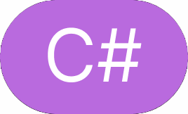
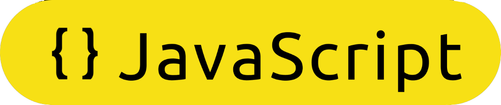
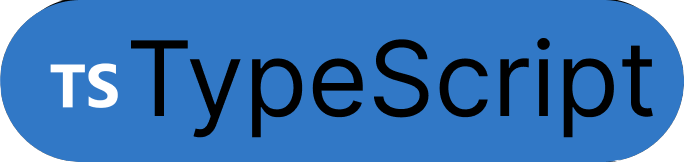
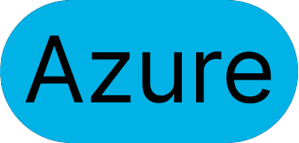

# 👨‍💻 Full-Stack Enterprise Architect aka `Md. Alim Ul Karim`

      

[Alim Ul Karim](https://www.google.com/search?q=alim+ul+karim) is over-hyped and over-priced Architect with excellent communication skills and reliable ✔ coding background. However, he cannot perform 💫 magic. [Alim Ul Karim](https://www.google.com/search?q=alim+ul+karim)/He solves unstable problems (bugs 🐛) in a 🐌 slow process with rigid fix✅. Alim believes in code quality than ⚡ faster delivery, it is often found that people destroy💥 the next stage of the game to just win the first stage by introducing [☢️technical debt](https://en.wikipedia.org/wiki/Technical_debt).

[Improve the header by feedback](https://docs.google.com/forms/d/e/1FAIpQLScHLOSYKe8OK7msB8xMNSz0b7b9T0xe7TY_B3BsYX4CoMbZ_w/viewform?usp=sf_link)

## [Alim Now](https://www.google.com/search?q=alim+ul+karim)

- ✨ Full-Stack Software Architect
-  Principal Software Engineer at Validata Group.
-  Founder and Architect @x-product.
-  Currently working on **T24**, **Teminos**, **Azure**

## [Provides Services](Providing-Services.md)

Providing services are **✔ exclusive to the company** alim works and is **❌ not** applicable to other companies. To get the service hire alim exclusively, it should change the linkedin as well.

- 🔧 Enterprise Software Design | Serverless design
- [💪Teambuilding, Training and Mentoring](Providing-Services.md#coaching--mentoring)
- [👨‍💼 Management Consulting](Providing-Services.md#alims-method-for-hiring-employees)
- 📝 CV analysis
- 🧠 Converting software engineer to Lead Engineer/Architect
  
## [Experience](https://www.linkedin.com/in/alimkarim/details/experience)

1. [Principal Software Engineer @ Validata Software Group (11 months)](experience/001.Principal-Software-Engineer-Validata-Software-Group.md) - Azure, Azure Storage, C#, [Selenium](https://www.selenium.dev) Recording, JavaScript
      - Memory optimization **30% - 40%** on automated recording with [Selenium](https://www.selenium.dev).
1. [Founder and Architect @ x-product](experience/002.Founder-and-Architect-x-product.md) - C#, MSSQL, ASP.NET MVC, Blazor, JavaScript, Xmind - [the-xproduct.com](http://the-xproduct.com)
   - Created a brand in small scale and planning to create new programming language along with my research.
1. [Senior Software Architect + CTO (CIMUX) @ Evatix (~2 years)](experience/003.Senior-Software-Architect-CTO-cimux-Evatix.md) - [Golang](https://go.dev/), [JavaScript](https://en.wikipedia.org/wiki/JavaScript), Bash, Linix, Nginx, Redis, [Asynq](https://github.com/hibiken/asynq)
   - Created [golang echo system](https://gitlab.com/evatix-go) for the team, along with 50%+ progress on a hosting solution with 2 backend developer only.
1. [C#.NET Software Architect @ Crossover (1.7 years)](experience/004.Csharp-dot-NET-Software-Architect-Crossover.md) -  C#, Roslyn Compiler [...](experience/004.Csharp-dot-NET-Software-Architect-Crossover.md)
   - Amplified the metrics from **15K** to **35K** LOC per week. [BPR](https://en.wikipedia.org/wiki/Business_process_re-engineering) for [**Fogbugz**](https://twitter.com/FogBugzTeam/status/1098573550418444289).
1. [C#.NET Software Engineer @ Crossover](experience/005.Csharp-dotNET-Software-Engineer-Crossover.md) (~1.6 years+) - C#, Java, JavaScript [...](experience/005.Csharp-dotNET-Software-Engineer-Crossover.md)
    - Controlled more than **8** countries and touched **90%** of **C#** products from EWS Capital Group.
1. [Imagine Cup National Judge for Bangladesh 2017 @ Microsoft](experience/007.Imagine-Cup-National-Judge-for-Bangladesh-2017-Microsoft.md)
    - Verified Imagine Cup Bangladesh 2017 local projects at Microsoft Bangladesh office.
1. [Full Stack Engineer @ Relisource](experience/006.Full-Stack-Engineer-Relisource.md) (1 year) - WCF, MEF, .NET, C#, .NET MVC, SQL Server, JavaScript, KendoUI, AngularJS, Less, Jquery
    - Acted as a **Full-Stack** engineer. Performed **code reviews** and **restructured** and **refactored** several tools.
1. [Software Engineer (Level-2) @ Enosis](experience/008.Software-Engineer-Level-2-Enosis.md) (4 months) - .NET, C#, LINQ, JavaScript, Kendo
    - Amplified system **scalability** on page loading issue.
1. [System Analyst & Lead @ Developers Organism](experience/009.System-Analyst-and-Lead-Developers-Organism.md) (6.5+ years) - C#, .NET, VB.NET, TypeScript, JavaScript, Telerik, Kendo UI, MSSQL, MS Access, CrystalReports
   - System designed and analyzed over 4+ enterprise applications and many other for training purpose.
1. [Core Programmer @ North South University](experience/010.Core-Programmer-North-South-University-NSU.md) (4 months) - PHP, MySQL, Symfony
   - Learned **"Symfony"** framework from 0.
1. [PHP Core Programmar/ Analyst @ Evatix](experience/011.PHP-Core-Programmar-Analyst-Evatix.md) (1 year) - PHP, MySQL, JavaScript, Joomla, Magento, VB.NET
   - Opportunity to work with more **20+** real-world applications, still running successfully.
1. [Senior Programmar @ Ethics Advance Technology Limited](experience/012.Senior-Programmar-Ethics-Advance-Technilogies-Limited.md) (~1.7 years) - VB.NET, Crystal Report, Oracle
   - Written **150+** business logic related functions.
1. [.NET Develoer @ Ethics Advance Technology Limited](experience/013.DotNET-Develoer-Ethics-Advance-Technilogies-Limited.md) (4 months) - VB.NET, Crystal Report, Oracle
   - Worked ODBD provider and created department specific software.
1. [Trainee @ Ethics Advance Technology Limited](experience/014.Trainee-Ethics-Advance-Technilogies-Limited.md) (5 months) - VB.NET, Crystal Report, Oracle
   - Learn working with corporate environment and created crystal reports.

## Research

- [The Daily Star - MVC Bootstrapper, building a system just got easy by Alim Ul Karim](https://www.thedailystar.net/bytes/mvc-bootstrapper-building-system-just-got-easy-120904)
- [Automatic Unit Test Tool at Crossover as Software Architect, Marketed as service](https://docs.google.com/document/d/1aKmPqY1qtklPuvhJ1b8QYmM702Ef0oZ3WbBpzX_e7Tg/edit)
  - One team (3-4 C# Software Engineers) made their metrics using this tool.

## 📺 Telivision Appearance

- [Alim Ul Karim appeared on ATN News - to verify fraud websites - October 16, 2017](https://www.youtube.com/watch?v=qCQC_sDSpsI&t=771s&ab_channel=ATNNews)
- [Alim Ul Karim appeared on ATN News - for blue whale research](https://www.facebook.com/1130911353/videos/10213133031857012/)

## Like To Discuss About

- ⚙️Automation
- 🛠️System Architecture
- 👔Business requirements
- 🐛General Concepts on solving any problem

## 🤹🏻Skills

       

- [Alim Skills Stacks in Image Format](Alim-Ul-Karim-Tech-Stack-Skills-Image-Format.md)
- [Alim Skills Stacks in Test Format for Search](Alim-Ul-Karim-Tech-Stack-Skills-Text-Format.md)

## Alim Ul Karim's Profile

- Stackoverflow
  - [Md. Alim Ul Karim](https://meta.stackoverflow.com/users/513511/md-alim-ul-karim)
- GitLab
  - [@aukgit.evatix](https://gitlab.com/aukgit.evatix)
  - [@akarimv3](https://gitlab.com/akarimv3)
  - [@aukgitlab](https://gitlab.com/aukgitlab)
  - [auk-go](https://gitlab.com/auk-go)
  - [evatix-go](https://gitlab.com/evatix-go)
- Nuget
  - [Auk with 280K downloads](https://www.nuget.org/profiles/Auk)
- GitHub
  - [aukgit](https://github.com/aukgit)
  
## Open Source Notable Projects

- GitHub
  - [Dhaka Residential Model College Result Analyzer](https://github.com/aukgit/Dhaka-Residential-Model-College-Result-Analyzer)
  - [AnimateJs](https://github.com/aukgit/AnimateJs)
  - [DevMvcComponent](https://github.com/aukgit/DevMvcComponent)
  - [ASP.NET MVC Bootstrapper](https://github.com/aukgit/ASP.NET-MVC-Bootstrapper)
  - [JavaScript MVC Framework](https://github.com/aukgit/JavaScript-MVC-Framework)
  - [WeReviewProject](https://github.com/aukgit/WeReviewProject)
- [Nuget Auk with 280K downloads](https://www.nuget.org/profiles/Auk)
  - [AUT.TestProjects.GenerationVersion2](https://www.nuget.org/packages/AUT.TestProjects.GenerationVersion2)
  - [AUT.ConfigureTestProjects](https://www.nuget.org/packages/AUT.ConfigureTestProjects)
  - [AUT.TestProjects.GenV6](https://www.nuget.org/packages/AUT.TestProjects.GenV6)

## 📑 Code Review Guide

- [Complex Condition Code Review](https://hackmd.io/iHlYRd1nTVajkikqeMo1QQ)
- [Golang Code : Review Guides](https://hackmd.io/xvs9BYFXTtCUzLB43ecVkA)
- [Complex Condition Code Review](https://hackmd.io/@alimhackmd/B1q1HOscq)
- [Front-end code Review notes](https://hackmd.io/@alimhackmd/rkSO1sjVs)
- [Code Review Notes](https://hackmd.io/@alimhackmd/ryCIJijNi)
- [C# code review guide (unofficial)](https://docs.google.com/document/d/1nTCocaJf3IeD3YgfJFuK9u7C-4mdIsyTzgyEiaoFC4M/edit?usp=sharing) - share feedback to make it done

## [Alim's Youtube Videos](https://docs.google.com/document/d/1by2ekgmRQbOIrnl7PzIY2hiV15O3Nw55RNDeUXtQ3Og/edit?usp=sharing)

Over the years Alim has released many YouTube tutorials to better explain different programming tutorials and helpful guides.

[Share 📝 feedback form](https://docs.google.com/forms/d/e/1FAIpQLScJc2VmeVFkmy84lUku5Z4DR8tIJU1p2LA79HUvao8VcGWMdQ/viewform?usp=sf_link)

**Your valuable feedback helps us to create better content in the future.**

## Why you should hire Alim ❓

- [How Alim Started❓](How-Alim-Started.md)
- [Why you should hire Alim ❓](Why-you-should-hire-Alim.md)
  - Alim is not an out-of-the-world developer even though [A senior architect and a leader](https://www.linkedin.com/in/istiaq-ahmed-b6906416?lipi=urn%3Ali%3Apage%3Ad_flagship3_profile_view_base_recommendations_details%3BeG4EMt3gQE6%2Fb%2BoFihyCOg%3D%3D) recommend him like  “ Alim is one of those out of this world developers that keep impressing you everyday. He is truly gifted”
- [Why you should ❗not hire Alim❓](Why-you-should-not-hire-Alim.md)
  - Alim is an excellent developer but you must consider the following things before you hire Alim.
    - Alim is an experienced developer; but, if you do not require experience, do not hire Alim.
    - If you're on a tight budget or you run a small organization, don't hire Alim. He's pricey.

## FAQ

- [Frequestly asked questions to Alim](FAQ.md)

## Connect With Alim

-   LinkedIn: [Md. Alim Ul Karim](https://www.linkedin.com/in/alimkarim/)
- 📧 Email: me {at} alimkarim.com

## Feedback On The Profile

Do you like Alim's profile? Please let us know in this [📝 form](https://docs.google.com/forms/d/e/1FAIpQLSeetNzg3L-DJGQylsSoBs6npO0jpFWvl-EDDr8jqT6NNNPIwA/viewform?usp=sf_link) and also let us know what can be improved. Alim appreciates feedback and any constructive criticism.
