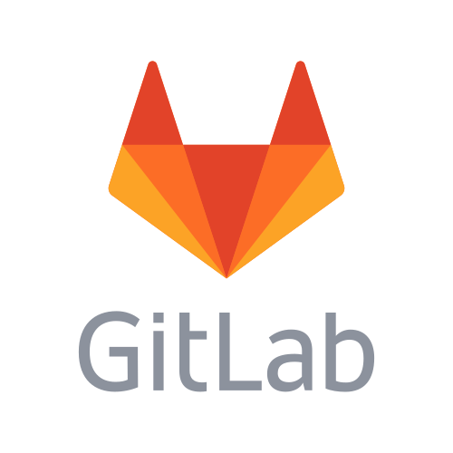

# Senior Software Architect + CTO @Evatix

## Aug 2020 – May 2022 (~2 years)

### [← Back](../alim-ul-karim-profile.md)

## Technology Stack

                  

## Recommendations from Co-Workers

### [Rokon Uz Zaman](https://www.linkedin.com/in/rokonz?lipi=urn%3Ali%3Apage%3Ad_flagship3_profile_view_base_recommendations_details%3BO9CCIqdYQ%2B%2BEDJ882sN3%2FA%3D%3D)

__Position in the Organization:__ Sr. Software Engineer

__Current Position:__ Sr. Software Programmer at Nexdecade Technology Pvt. Ltd.

__Remarks:__ I met Mr. Karim around 2010, he was just a kid and comparing his age, he was barely suited with us. However, his analyzing capabilities, database design abilities and quick adaption to any technology impressed all of us. Comparing the age he was barely suited, however with his qualities and abilities he was mostly one of us in no time. Finally, I would like to wrap up by wishing him a good luck in his future endeavors.

### [Meer Adnan Ali](https://www.linkedin.com/in/meer-adnan-ali-8492b441?lipi=urn%3Ali%3Apage%3Ad_flagship3_profile_view_base_recommendations_details%3BO9CCIqdYQ%2B%2BEDJ882sN3%2FA%3D%3D)

__Position in the Organization:__ Vice President Of Operations

__Current Position:__ Vice President Of Operations at Evatix

__Remarks:__ Alim was a very potential and hard working young programmer at Evatix. He has worked on number of projects and had the dedication to complete them on time. We wish him all the best in his future endeavors.

### [Nur Sarowar](https://www.linkedin.com/in/nursarowar?lipi=urn%3Ali%3Apage%3Ad_flagship3_profile_view_base_recommendations_details%3BO9CCIqdYQ%2B%2BEDJ882sN3%2FA%3D%3D)

__Position in the Organization:__ Managing Director

__Current Position:__ Managing Director, Evatix.

__Remarks:__ Alim is quick at study and adapts very easily in new projects, picking up the overall project scope with ease. Alim is also an excellent team player and communicator. I would work again with him in a heartbeat and know he will be a great asset to any team or project.

### [Hasanul Banna](https://www.linkedin.com/in/hasanulbanna?lipi=urn%3Ali%3Apage%3Ad_flagship3_profile_view_base_recommendations_details%3BO9CCIqdYQ%2B%2BEDJ882sN3%2FA%3D%3D)

__Position in the Organization:__ Software Developer

__Current Position:__ Software Engineer I at USAA

__Remarks:__ I called him spiderman, he is one of the few incredibly intuitive software developer I've met. He was unparalleled in his ability to find interesting solutions to critical problems. He understood every requirement very well, developed solution and wrote code accordingly, which comprised his sound technical ability. As part of the development team, Alim had great success in developing good relationships with co-workers and team leaders. He always sees the bright side of things and puts a smile on others face, even under extremely critical situation. Eventually, it was a great privilege for me to work with him. I wish him sure success on every step of his life.

## Responsibilites and Achievements

💡 __Architected__ and created spec for business:

&nbsp;&nbsp;&nbsp;&nbsp;✔ Installer package which can install recipes or formulas like __brew__ or __chocolatey__. Recipes and formulas can be __dynamically__ injected for newer packages or different version installations.

&nbsp;&nbsp;&nbsp;&nbsp;✔ System __configuration__ (eg. user, group manage, ethernet adapter IP set, and many more can be done from JSON instructions)

&nbsp;&nbsp;&nbsp;&nbsp;✔ Full operating system can be configured by __JSON__. __CLI__ will invoke __Asynq__ (Redis server) and it will create JSON requests to set or modify the system.

&nbsp;&nbsp;&nbsp;&nbsp;✔ Maintained over __15+__ GO packages and __self-written__ from scratch __6+__ GO packages related to system programming and __automation__ towards faster __delivery__. All the packages were written from __0__.

💡 Coached, Code Reviewed, mentored, hired team members for Golang, TypeScript, and little React, NextJS

💡 Worked with __Linux__ system, and tooling installations such as Nginx, Apache, PowerDNS, ethernet adapters, user and group management, crontabs, file system management, etc.

💡 Enforced organization-wide __code review guides__ to be consistent with code writing and reviewing.

&nbsp;&nbsp;&nbsp;&nbsp;✔ __Don’t__ allow code __mutation__. Things should be created at once like __functional__ languages.

&nbsp;&nbsp;&nbsp;&nbsp;✔ __Gracefully__ handle an error with the proper ruling. (framework written)

💡 __Verified__ and written integrated tests with/without docker (to run faster we apply some devious paths, however, gives quick success results).

💡 Started __GO__, Linux Systems from __0__.

## Team Members

💡 4 team members.

## Projects

### `Hosting solution`

#### Project Tech stack

     

#### Description

- Hosting solution, controlling feature, file management.
- Using web interface and additional packages like Nginx, powerDNS.

### [`CIMUX (Control Panel Project)`](https://gitlab.com/evatix-go)

#### Project Tech stack

   

#### Description

- Operating System manage system software controlled from web UI just like cPanel.

### [`PersonalVPN (Windows Version)`](https://www.personalvpn.com/)

#### Project Tech stack

##      ipSec tcp CEF

#### Description

- Enterprise-level __VPN__ project for __encrypting__ and __hiding__ data.

### [← Back](../alim-ul-karim-profile.md)