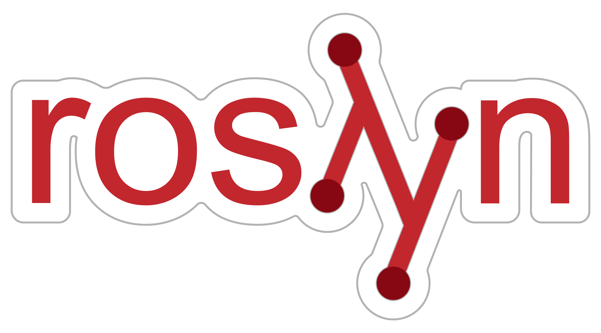

# C# .NET Software Architect @ Crossover

## Jul 2018 – Jan 2020 (1.7 years)

### [← Back](../alim-ul-karim-profile.md)

## Technology Stack

              

## Recommendations from Co-Workers

### [Waleed Mohsen](https://www.linkedin.com/in/waleed-mohsin-7a2b898?lipi=urn%3Ali%3Apage%3Ad_flagship3_profile_view_base_recommendations_details%3BO9CCIqdYQ%2B%2BEDJ882sN3%2FA%3D%3D)

__Position in the Organization:__ Software Engineer

__Current Position:__ Senior Consultant Mendix at S4Digital

__Remarks:__ We met many people every day, but only some leave the marks, and one of them is Alim.

### [Alexander Netrebskii](https://www.linkedin.com/in/alexander-netrebskii-26aa665a?lipi=urn%3Ali%3Apage%3Ad_flagship3_profile_view_base_recommendations_details%3BO9CCIqdYQ%2B%2BEDJ882sN3%2FA%3D%3D)

__Position in the Organization:__ Chief Software Architect (C#)

__Current Position:__ Head of Software Development at aqua cloud GmbH

__Remarks:__ I had the pleasure of working with Alim when I joined an innovated project about a static code analyser that he led.

It was a complex product, but his way of organizing the knowledge base, the architecture decisions, and innovation mindset were reasons of success. Also, Alim always went out of their way to help the team, providing technical and product coaching.
I am delighted to work with such professionals.

### [Gaurav Thakur](https://www.linkedin.com/in/gmsgthakur?lipi=urn%3Ali%3Apage%3Ad_flagship3_profile_view_base_recommendations_details%3BO9CCIqdYQ%2B%2BEDJ882sN3%2FA%3D%3D)

__Position in the Organization:__ Software Architect

__Current Position:__ Software Architect at Crossover

__Remarks:__ Alim is a very knowledgeable developer and Architect,
he gets around solving issues in a very fast clean way, works great under pressure always keeping the code up to the highest standards, I've had the opportunity to work hand by hand with him and his support in crossover Organization on Fogbugz product in solving live issues has been the key to success. He has great expertise in AWS Stack, Services.

### [Muhammad Daniyal Khan](https://www.linkedin.com/in/mdaniyal-khan?lipi=urn%3Ali%3Apage%3Ad_flagship3_profile_view_base_recommendations_details%3BO9CCIqdYQ%2B%2BEDJ882sN3%2FA%3D%3D)

__Position in the Organization:__ C# (.NET) Software Engineer

__Current Position:__ Software Engineer III at Aurea Software

__Remarks:__ Alim is great guy and developer. He is expert in devops specially continuous integration and aws cloud operations. He created lot of tools to simplify unit testing by automating repeating patterns. He mentored many new hiers in crossover. I found Alim very friendly, trustworthy and honest person.

### [Faical Said](https://www.linkedin.com/in/faical-said?lipi=urn%3Ali%3Apage%3Ad_flagship3_profile_view_base_recommendations_details%3BO9CCIqdYQ%2B%2BEDJ882sN3%2FA%3D%3D)

__Position in the Organization:__ C# (.Net) Software Architect

__Current Position:__ Manager at KPMG Luxembourg

__Remarks:__ When I started at Crossover, Alim was the most welcoming person to me. I can't forget how kind and respectful he was when I met him in my first week. Since that time, Alim was such wonderful colleague. He demonstrated his advanced level of expertise and was one of the best performing in every aspect. Beside his high level of technical abilities, Alim was one of the person that I most enjoyed working with during my career. I highly recommend Alim and wish him good luck.

### [Gennady N.](https://www.linkedin.com/in/gennady-nikolaev?lipi=urn%3Ali%3Apage%3Ad_flagship3_profile_view_base_recommendations_details%3BO9CCIqdYQ%2B%2BEDJ882sN3%2FA%3D%3D)

__Position in the Organization:__ No information found

__Current Position:__ Vice President of Software Engineering at ESW Capital

__Remarks:__ Alim is a fantastic person. He's smart and opinionated, passionate and eager to get the work done. I was happy to work with Alim for some time and wish our paths will meet again one day.
I strongly recommend Alim as a deep-thinking and problem-oriented professional, which can bring great innovation ideas to any team.

### [Konstantinos Papakonstantinou](https://www.linkedin.com/in/konstantinos-papakonstantinou-59691819?lipi=urn%3Ali%3Apage%3Ad_flagship3_profile_view_base_recommendations_details%3BO9CCIqdYQ%2B%2BEDJ882sN3%2FA%3D%3D)

__Position in the Organization:__ Senior Software Engineer

__Current Position:__ Senior Serverless Engineer at Lumar (formerly Deepcrawl)

__Remarks:__ I joined Alim's team around 6 months ago, and we have been working together on C# Test Generator product, a tool that is able to automatically generate unit tests for C# projects. He was the sole developer of the team, before I joined it, and he had developed the tool from scratch. From the first moment I started working on the tool, I had realized how solid and of high quality the work he has done on the product was. The code was really well written, following common design patterns and conventions, and structured in such a way that allowed me to be productive in a very short amount of time.
As he has been my trainer, mentor and leader of the team, the preparatory work he has done on documenting the tool, but also his eagerness and readiness to help when needed, made my on-boarding process, maybe the smoothest on-boarding process I have had in my whole career. His great leading capabilities have been obvious from the first moment, as he is able to effectively handle work pressure and challenges set by higher management.
Before joining Alim's team, he has also been my mentor during "Bootcamp", a 4-week training program where candidates are educated on what is needed to succeed on the job. The tasks that he was preparing and assigning to me during that program were unveiling how committed professional he is and how skillful he is on software design and on capturing the "big picture".
His open-mindedness and nice personality makes him a very pleasant person to work with.

### [Mohammad Abdul Kadir](https://www.linkedin.com/in/mohammad-kadir?lipi=urn%3Ali%3Apage%3Ad_flagship3_profile_view_base_recommendations_details%3BO9CCIqdYQ%2B%2BEDJ882sN3%2FA%3D%3D)

__Position in the Organization:__ C# (.NET) Software Engineer

__Current Position:__ No information

__Remarks:__ I had the pleasure of working with Alim at the Crossover. Alim was my mentor, he trained me on CsharpTestGenerator(a tool that can generate unite test for C# project). This is one of the great tools that I have ever used. It can cover 25-50 % of LOC(Line of code) depending on the project types. Alim is the maintainer and architect of this AI based tool. Alim always reached the goal within the time and also take care of other team members so that all can reach their goal too. As a leader to me, Alim is one of the best because, if needed he will fight with others for you to get the things right. One thing that I liked most about him that he documented all the things whether new training session or resolving any specific issues. During the time I worked with Alim, I enjoyed his mentorship and leadership. I will always look forward to work with him again.

### [Hayo Lubbers](https://www.linkedin.com/in/hlubbers?lipi=urn%3Ali%3Apage%3Ad_flagship3_profile_view_base_recommendations_details%3BO9CCIqdYQ%2B%2BEDJ882sN3%2FA%3D%3D)

__Position in the Organization:__ Senior Technical Consultant

__Current Position:__ ServiceNow consultant at Quint

__Remarks:__ Alim joined the team without specific knowledge of the product. As a senior in the team I've seen many people come and go. Alim was one of the people with a steep learning curve and it was a pleasure to work with.

### [Marek Flejszman](https://www.linkedin.com/in/marekflejszman?lipi=urn%3Ali%3Apage%3Ad_flagship3_profile_view_base_recommendations_details%3BO9CCIqdYQ%2B%2BEDJ882sN3%2FA%3D%3D)

__Position in the Organization:__ Software Engineering Manager

__Current Position:__ Senior Software Development Manager at CAPTRON Polska

__Remarks:__ Alim Karim was a member of the team I managed for 10 months. I remember him as one of the most competent and talented developers I knew, and also as a person who feels the responsibility not only for his own work but for the results of the entire team as well. Alim's work exceeded a developer's scope of obligation: he made himself known as a talented architect and team leader. His commitment and diligence caused that even the most difficult tasks could be carried out by the team on time. I strongly recommend cooperation with Alim to every software manager.

### [Gabor Szekeres](https://www.linkedin.com/in/gabor-szekeres?lipi=urn%3Ali%3Apage%3Ad_flagship3_profile_view_base_recommendations_details%3BO9CCIqdYQ%2B%2BEDJ882sN3%2FA%3D%3D)

__Position in the Organization:__ Software Engineering Manager

__Current Position:__ Lead Engineer at NDVR, Inc.

__Remarks:__ Alim was one of the most committed members of my unit test automation team. For a while he single-handedly drove the C# division, managing both engineering work and the developer bootcamp we had running in parallel. I strongly recommend him.

### [Sahil Goyan](https://www.linkedin.com/in/goyal-sahil?lipi=urn%3Ali%3Apage%3Ad_flagship3_profile_view_base_recommendations_details%3BO9CCIqdYQ%2B%2BEDJ882sN3%2FA%3D%3D)

__Position in the Organization:__ Technical Consultant

__Current Position:__ Technical Delivery Manager at Aurea Software

__Remarks:__ Md. Alim is a true professional with immense knowledge on coding especially C# and JavaScripts. Over and above being technically sound he has a extremely Positive attitude and is a real asset for any team to have. It has been a pleasure to have worked with Md. Alim.

### [Golam Kibria](https://www.linkedin.com/in/doubledecker?lipi=urn%3Ali%3Apage%3Ad_flagship3_profile_view_base_recommendations_details%3BO9CCIqdYQ%2B%2BEDJ882sN3%2FA%3D%3D)

__Position in the Organization:__ Software Engineer

__Current Position:__ Chief Software Architect at Crossover for Work

__Remarks:__ Alim is a sincere, passionate and above all a very knowledgeable person. He is always willing to take the extra step it takes to get a job perfectly done. His coding patterns are of industry standard and he always ensures he is following the best practices. Having him around you will make your professional life a lot more enjoyable, as he is very keen to help his peers.

## Responsibilites and Achievements

💡 Amplified the metrics from __15K__ to __35K__ LOC per week (improved by __133.35%__, overall __6__ SE x __133.35__ = __812.1%__ improvements).

💡Coached, mentored, prepared questions and graded with code reviews over __50+__ [CA (__100K/y__), SA(__60k/y__)] candidates at Crossover Bootcamps (__35+ Bootcamps__).

💡Business process rewrite (BPR) for Fogbugz [Similar to Jira in small scale] (__~1.6m__ to __~5k__ LOC).

&nbsp;&nbsp;&nbsp;&nbsp;✔Condensed from MSSQL and Classic ASP to Angular 8, NodeJS, AWS stack (Dynamo DB, Lamda).

💡Gained skilled at assembly line (__AL__) process (Trilogy, Aurea, ESW Capital).

💡Acted as __Product Chief Architect__ (lead), and led __two__ teams at Crossover.

💡Empowered DevOps __CI/CD__ based __automation__ scripts and static analyzer tool which can __predict__ and __estimate__ coverage gain without running the actual coverage tool such as NUnit, DotCover, VSTestConsole.

&nbsp;&nbsp;&nbsp;&nbsp;✔Highly __scalable__ which can utilize __72+__ (any number) AWS processors.

&nbsp;&nbsp;&nbsp;&nbsp;✔__Self-deploy__ and __self-running__ machine command __integrated__.

💡Made __inception__ of an elite framework using RoslynCompiler which provides enhanced AST experience.

💡Improved and __increased__ mutation __coverage__ for the test patterns.

💡__Responsible__ for writing and maintaining standalone package __Powershell__ script which can run and automate all __CI/CD__ pipeline(s) and can be configured with __JSON__ for NUnit, DotCover, VsTestConsole, cloc, ReportGenerator and many more tools.

💡__80%__ of the time was involved in coding and architecting stuff.

💡__Co-founder__ and the maintainer for C# Automatic Unit Test Tool.

## Team Members

💡 100 team members.

## Projects

### [`FogBugz (Trilogy Group)`](https://twitter.com/FogBugzTeam/status/1098573550418444289)

#### Project Tech stack

        

#### Description

- Rewrite __5k__
- __1.6m__ to __5k__ code
- A similar project as Jira on a small scale using AWS stacks

### [`C# Automatic Unit Test Generator (Trilogy Group)`](https://docs.google.com/document/d/1aKmPqY1qtklPuvhJ1b8QYmM702Ef0oZ3WbBpzX_e7Tg/edit)

#### Project Tech stack

##        String4Template

#### Description

- Automatic Unit Test Generator tool for __C#__, it can run over any C# __code__ and generate unit test based on __pattern__ matching it will __output__ unit tests.

### `C# Static Analyzer Tool (Trilogy Group) `

#### Project Tech stack

##      String4Template WCF

#### Description

- Can __estimate__ and predict code coverage from non-buildable code, it can yields __75%__ accurate result comparing with actual code coverage tool.

### [← Back](../alim-ul-karim-profile.md)
