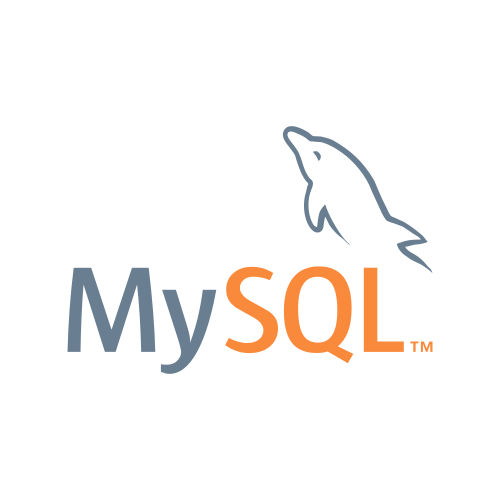

# Core programmer @ North South University

## Jun 2011 – Sep 2011 (4 months)

### [← Back](../alim-ul-karim-profile.md)

## Technology Stack

  

## Recommendations from Co-Workers

### [Ehtesham Choudhury](https://www.linkedin.com/in/ehtesham-choudhury-1b940921?lipi=urn%3Ali%3Apage%3Ad_flagship3_profile_view_base_recommendations_details%3BO9CCIqdYQ%2B%2BEDJ882sN3%2FA%3D%3D)

__Position in the organization:__ Faculty

__Current position:__ Engineering Manager @ Ceridian Talent Intelligence

__Remarks:__ Alim is one of the brightest student I have ever come across. I met him while he was in the first year of bachelor program in CS but I found himself highly proficient with programming. Not only coding but also he used to possess outstanding knowledge about code Organization and software engineering methodologies. I wish him one of the brightest future ahead...Good Luck !

## Responsibilites and Achievements

💡 Learned new PHP framework "Symfony" and created new APIs and integrated those with the framework.

💡 Designed a website for North South University.

💡 Reported back to my supervisor Dr. Shazzad Hossain.

## Team Members

💡 5 team members.

## Projects

### `NSU Human Resource`

#### Project Tech stack

  

#### Description

- Learned new PHP framework __"Symfony"__.
- Created new __APIs__ and integrated those with the framework.
- Designed __website__ for North South University.
- Served university human resource project development.
- __Generated__ HR reports.
- Reported back to my __supervisor__ Dr. Shazzad Hossain, it was really an honor working with him.

### [← Back](../alim-ul-karim-profile.md)
